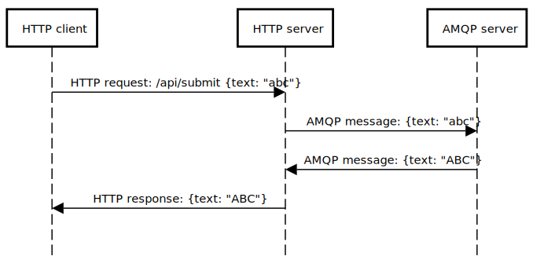

# Expressway

An example program that combines async HTTP and AMQP operations.  It
shows how to use JavaScript async/await with [Express][express] and
[Rhea][rhea] in order to process HTTP requests concurrently.

[express]: https://expressjs.com/
[rhea]: https://github.com/amqp/rhea

## Installing dependencies

    npm install -g "express@>=5.0.0-beta.1"
    npm install -g rhea

## Running the AMQP server

    node amqpserver.py

## Running the HTTP server

    node httpserver.py

## Calling the HTTP API

    curl -X POST http://localhost:3000/api/submit -H 'Content-Type: application/json' -d '{"text": "abc"}'

## Expected output

AMQP server

    $ node amqpserver.js
    Listening on port 3001
    Received request {"text":"abc"} (0)
    Sent response {"text":"ABC"} (0)

HTTP server

    $ node httpserver.js
    Listening on port 3000
    Connected to AMQP server on port 3001
    Received HTTP request {"text":"abc"}
    Sent AMQP request {"text":"abc"} (0)
    Received AMQP response {"text":"ABC"} (0)
    Sent HTTP response {"text":"ABC"}

Client

    $ curl -X POST http://localhost:3000/api/submit -H 'Content-Type: application/json' -d '{"text": "abc"}'
    {"text":"ABC"}
